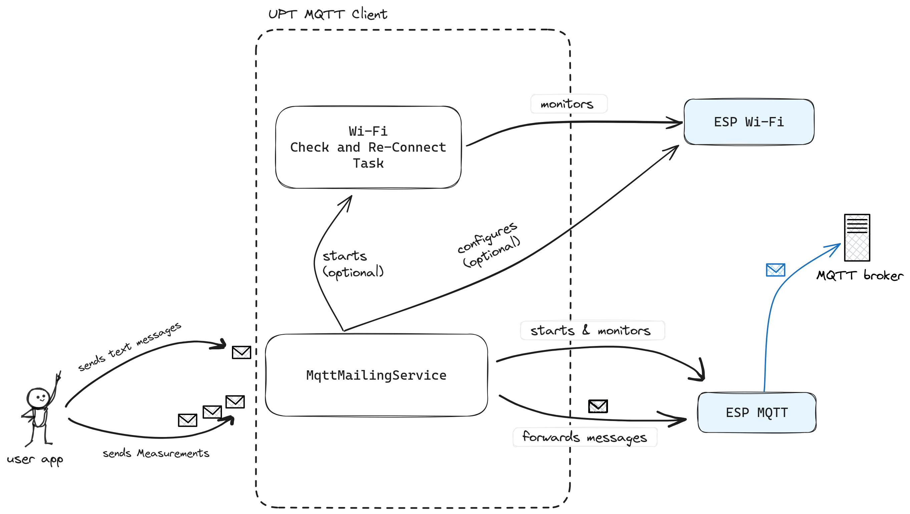

# Sensirion UPT MQTT Client

Arduino library for publishing messages to a MQTT broker.   
It offers a simplified interface to the Arduino Espressif Wi-Fi and ESP-IDF mqtt_client libraries.

## Disclaimer
The UPT MQTT module is in early development, and is not production ready.  
It is **not yet available through library managers**.  
Have a look at the open issues to know what to expect. 

## Getting started

### Recommended Hardware

This project was developed and tested on Espressif [ESP32 DevKitC](https://www.espressif.com/en/products/devkits/esp32-devkitc) and Lilygo [T-Display S3](https://www.lilygo.cc/products/t-display-s3) hardware.

### IDE

#### PlatformIO (recommended)
We recommend using the [PlatformIO VSCode extension](https://platformio.org/platformio-ide) to compile and flash the code in this example. 
You will find more instructions [here](documentation/platformio_usage.md)

#### Arduino IDE
It is also possible to use the application using *Arduino IDE*.
You will find more instructions [here](documentation/arduino_ide_usage.md)

### Usage
An example usage script is available in the `examples folder`.  
You will also find a detailed API description [here](documentation/api_reference.md)

## Dependencies

This library uses the following dependencies.

* [Arduino ESP32](https://docs.espressif.com/projects/arduino-esp32/en/latest/getting_started.html#about-arduino-esp32)
(In particular, the [Wi-Fi library](https://docs.espressif.com/projects/arduino-esp32/en/latest/api/wifi.html),
[message logging](https://docs.espressif.com/projects/esp-idf/en/latest/esp32/api-reference/system/log.html) and
[MQTT client](https://docs.espressif.com/projects/esp-idf/en/latest/esp32/api-reference/protocols/mqtt.html#api-reference)) \
__Caution__: the ArduinoEspressif implementation of the ESP MQTT Client does not match the official API documentation!
